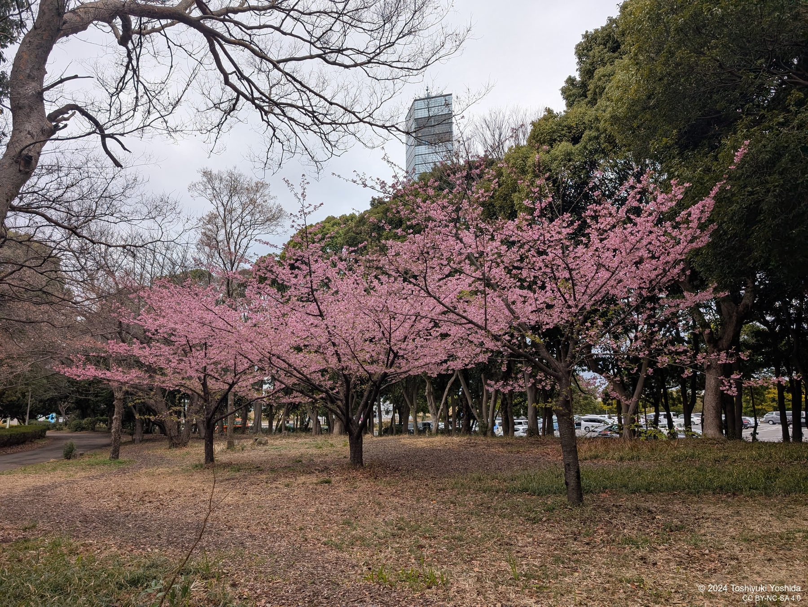

+++
title = "ポートタワーの桜"
description = "千葉ポートタワーに散歩に行ったら、もう桜が咲いていました。"
date = 2025-03-06
aliases = ["/articles/2025/03/06/Kawazu-sakura"]

[taxonomies]
tags = ["Photography","Seasons"]
[extra]
social_media_card = "ogp.webp"
+++

寒さが厳しいと思いながら千葉ポートパークを散歩していたら、もう桜が咲いていました。カワヅザクラかな。

