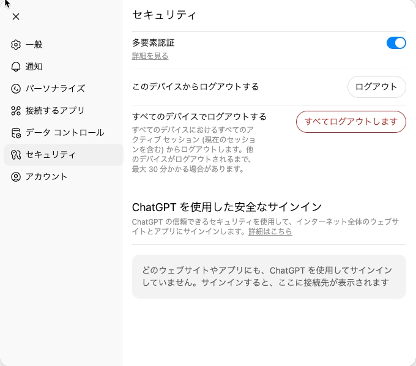

+++
title = "OpenAIではパスワード変更機能が提供されていない？"
description = "OpenAIでパスワードを変更しようとして、パスワード変更機能が提供されていないことに気付きました。"
date = 2025-07-18
aliases = ["/articles/2025/07/18/openai-pwd-change"]

[taxonomies]
tags = ["Tech", "Security"]
[extra]
social_media_card = "ogp.webp"
+++

最近はずっとClaudeを利用していてChatGPT/OpenAIはご無沙汰しています。
しかし、なぜかパスワードマネージャーからOpenAIのパスワードが使い回しという警告が出てしまったので、パスワードを変更することにしました。

しかし、ここで気付いたのです。パスワード変更機能が提供されていないということ
に。

以下は、OpenAIアカウントのセキュリティ設定画面です。

多要素認証の設定しかありません。
